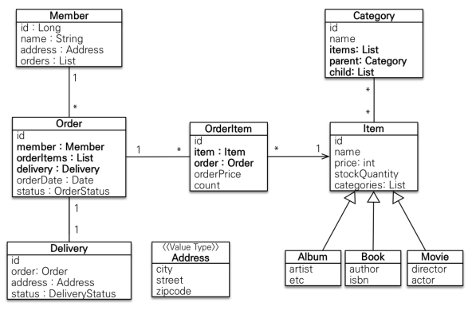

### 도메인 모델과 테이블 설계


- 회원, 주문, 상품의 관계
  - 회원은 여러 상품을 주문 가능
  - 한 번 주문할 때 여러 상품 선택 가능
  - 이런 다대 관계는 관계형 데이터베이스와 엔티티에서도 거의 사용 x
  - 따라서 주문상품이라는 엔티티를 추가하는 방법으로 다대다 관계를 일대다, 다대일 관계로 풀어냄

- 상품 분류
  - 상품은 도서, 음반, 영화로 구분되는데 상품이라는 공통 속성을 사용하므로 상속 구조로 표현

### 회원 엔티티 분석



- 회원 (Member): 이름과 임베디드 타입인 주소, 주문 리스트를 가진다.
- 주문 (Order): 한 번 주문 시 여러 상품을 주문할 수 있으므로 주문과 주문 상품 (OrderItem)은 일대다 관계
  - 주문은 상품을 주문한 회원과 배송 정보, 주문 날짜, 주문 상태 (status)를 가지고 있다.
  - 주문 상태는 열거형을 사용했는데 주문 (ORDER), 취소 (CANCEL)을 표현할 수 있음.
- 주문 상품 (OrderItem): 주문한 상품 정보와 주문 금액, 주문 수량 정보를 가지고 있다.
- 상품 (Item): 이름, 가격, 재고 수량을 가지고 있다. 상품을 주문하면 재고 수령이 줄어듦,
- 배송 (Delivery): 주문 시 하나의 배송 정보 생성. 주문과 배송은 일대일
- 카테고리 (Category): 상품과 다대다 관계. parent, child로 부모, 자식 카테고리 연결
- 주소 (Address): 값 타입. 회원과 배송에서 사용
- 참고: 회원이 주문을 하기 때문에, 회원이 주문 리스트를 가지는 것은 얼핏 보면 잘 설계한 것 같지만,
  - 실무에서는 회원이 주문을 참조하지 않고, 주문이 회원을 참조하는 것으로 충분하다.

### 회원 테이블 분석


- Member: 회원 엔티티의 Address 임베디드 타입 정보가 회원 테이블에 들어감.
- Item: 앨범, 도서, 영화 타입을 통합해서 하나의 테이블로 생성. DTYPE으로 구분
- Orders: ```ORDER```는 데이터베이스가 ```order by``` 떄문에 예약어로 잡고 있는 경우가 많음. 따라서 ```ORDERS```로 사용

### 연관관계 매핑 분석

- 회원과 주문: 일대다, 다대일의 양방향 관계. 이때 외래 키가 있는 주문을 연관 관계의 주인으로 설정
  - Order.member를 ORDERS.MMEMBER_ID 외래키와 매핑
- 주문상품과 주문: 다대일 양방향 관계. 외래 키가 주문상품에 있으므로 주문상품이 연관관계 주인.
  - OrderItem.order를 ORDER_ITEM.ORDER_ID 외래키와 매핑
- 주문상품과 상품: 다대일 단방향 관계.OrderItem.item를 ORDER_ITEM.ITEM_ID 외래키와 매핑
- 주문과 배송: 일대일 단방향 관계. Order.delivery를 ORDERS.DELIVERY_ID 외래키와 매핑