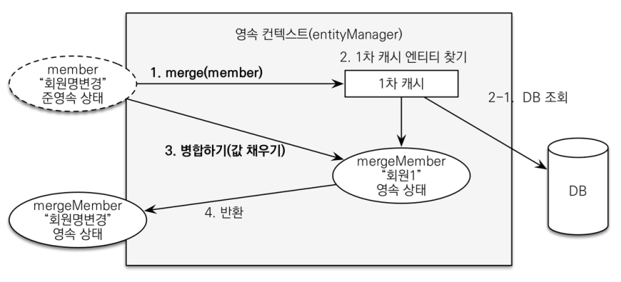

# 변경 감지와 병합

- 준영속 엔티티
    - 영속성 컨텍스트가 더 이상 관리하지 않는 엔티티
    - 임의로 생성한 엔티티도 식별자를 가지고 있으면 준영속 엔티티로 간주
- 준영속 엔티티를 수정하는 2가지 방법 
  - 변경 감지 기능 사용
    - 트랜잭션 안에서 엔티티를 다시 조회, 변경할 값 선택 -> 트랜잭션 커밋 시점에 변경 감지 (Dirty Checking)이 동작해서 update query 실행
  - 병합 사용 (merge)
    - 준영속 상태의 엔티티를 영속 상태로 변경할 때 사용하는 기능

### 병합 동작 방식



- ```merge()``` 실행
- 파라미터로 넘어온 준영속 엔티티의 식별자 값으로 1차 캐시에서 엔티티를 조회
  - 1차 캐시에 엔티티 없을 시 DB에서 엔티티 조회 후, 1차 캐시에 저장
- 조회한 영속 엔티티 (```mergeMember```)에 ```member``` 엔티티의 값을 채워 넣는다. (member 엔티티의 모든 값을 mergeMember에 밀어 넣음)
  - 이때 mergeMember의 ```회원1```이라는 이름이 ```회원명변경```으로 바뀜
- 영속 상태인 mergeMember를 반환

#### 간단히 정리

- 준영속 엔티티의 식별자 값으로 영속 엔티티 조회
- 영속 엔티티의 값을 준영속 엔티티의 값으로 모두 교체 (병합)
- 트랜잭션 커밋 시점에 변경 감지 기능이 동작해서 데이터베이스에 update sql 실행

#### 주의점

- 변경 감지 기능을 사용하면 원하는 속성만 선택해서 변경할 수 있지만, 병합을 사용하면 모든 속성이 변경
- 병합 시 값이 없으면 null로 업데이트할 위험 (병합은 모든 필드 교체)

### 좋은 해결 방법

- 엔티티 변경 시 항상 변경 감지 사용
  - Controller에서 어설프게 엔티티 생성 x
  - transaction이 있는 서비스 계층에 식별자와 변경할 데이터를 명확하게 전달 (파라미터 or dto)
  - transaction이 있는 서비스 계층에서 영속 상태의 엔티티를 조회하고, 엔티티의 데이터를 직접 변경
  - transaction 커밋 시점에 변경 감지 실행